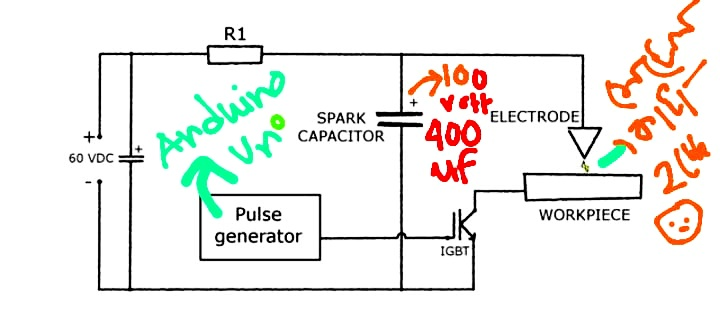
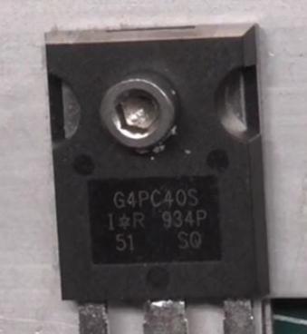

# EDM

### 🌕 EDM using 555 🌀 ( works in : 10 volt )

https://github.com/user-attachments/assets/0ce91ec2-dd03-4595-b938-38a47e7c434d

Developing a functional **EDM (Electric Discharge Machine)** for cutting thin 1mm metal sheets:  

 
<b>❌ 10 VOLT mini model SETUP & explain with LED 💡 & SOUND WAVE 🔊</b>

 
   
   

 

# creating a mini model of EDM ( 10 Volt 🌀 )

---

### **Step 1: Working Principle of EDM**
- EDM works by generating **electrical sparks** to erode metal surfaces.
- It requires a **power supply**, an **electrode**, a **workpiece**, and a **dielectric fluid**.
- The **electrode (cathode)** and **workpiece (anode)** are submerged in **dielectric fluid**, and a **high-frequency electrical discharge** removes metal from the workpiece.

---

### **Step 2: Required Components & Specifications**
| **Component**        | **Specification** |
|----------------------|------------------|
| **Step-down Transformer** | Converts **230V AC to 50-100V AC** |
| **Bridge Rectifier** | **50A capacity** for AC to DC conversion |
| **Capacitors** | **4.8µF, 450V** |
| **Electrode Material** | **Copper (35-70mm)** |
| **Dielectric Fluid** | **Distilled Water or Kerosene** |
| **Workpiece** | **Thin Steel or Copper Sheet** |
| **Control Circuit** | **Pulse Generator for Spark Regulation** |
| **Frame & Tub** | **60x30 cm size** |
| **Wires & Connectors** | High-voltage insulated wires |
| **Cooling & Flushing System** | Pump to circulate dielectric fluid |

---

### **Step 3: Build the Power Supply**
1. **Use a Step-Down Transformer**  
   - Converts **230V AC to 12-24V AC**.
   - Must have **multiple voltage outputs** for flexibility.
   
2. **Bridge Rectifier**  
   - Converts **AC to DC** for controlled spark generation.
   - Choose a **50A diode bridge** for sufficient power handling.
   
3. **Capacitor (for Smoothing DC Output)**  
   - Use **450V, 4.8µF capacitor** to stabilize voltage and reduce ripples.

---

### **Step 4: Design the Electrode System**
- **Electrode:** Use **copper** due to its excellent conductivity.  
- **Workpiece:** Choose **thin steel or copper sheet** for easier cutting.  
- **Spark Gap:** Maintain **5-10mm** gap between electrode and workpiece.  

---

### **Step 5: Setup Dielectric Fluid System**
- Use **distilled water** or **kerosene** to act as an insulator and coolant.  
- Ensure **continuous circulation** with a **pump** to flush debris and cool the cutting area.  

---

### **Step 6: Assemble the EDM Machine**
1. **Mount the Workpiece & Electrode** inside the **dielectric tub**.  
2. **Connect the Power Supply** (transformer, rectifier, capacitor).  
3. **Ensure Proper Spark Gap** for controlled erosion.  
4. **Install the Pulse Generator Circuit** to regulate spark intensity and frequency.  

---

### **Step 7: Perform Initial Testing & Calibration**
- Test with **low voltage (50V)** and gradually **increase up to 100V**.  
- Observe **spark discharge and material removal rate**.  
- Adjust **gap, pulse frequency, and voltage** for optimal performance.  

---

### **Step 8: Demonstration & Final Adjustments**
- Cut a **thin steel or copper sheet** to show EDM functionality.  
- If sparks are inconsistent, **adjust capacitor values and pulse timing**.  
- Ensure **safety measures** (proper insulation, emergency cutoff).  

---

### **Final Notes**
- The project document provides **detailed calculations** (e.g., spark voltage = 48.42V, power consumed = 2370W).  
- The **machine does not need to be industry-grade**, but it should **demonstrate material removal effectively**.  

   

---

## **EDM Circuit Diagram Explanation with Cost**  

---

### **Step 1: Step-Down Transformer**  
**Component:** **230V to 24V Step-Down Transformer**  
- **Specification:** 230V AC input → 24V-0-24V AC output, **1.5A current rating**  
- **Function:** Reduces **high-voltage AC (230V) to a lower AC voltage (24V)**, preventing excessive current flow.  
- **Reason for Use:** Protects circuit components from high voltage and provides suitable power for further rectification.  
- **Cost (India):** ₹250 - ₹400  

**Connections:**  
- **Primary winding** connected to **230V AC mains**.  
- **Secondary winding** gives **24V-0-24V AC output**, which will be converted to DC.  

---

### **Step 2: Bridge Rectifier (AC to DC Conversion)**  
**Component:** **50A Bridge Rectifier Module**  
- **Specification:** **Input: 24V AC**, **Output: 24V DC**, **Diode rating: 50A, 1000V PIV**  
- **Function:** Converts the **AC output of the transformer into pulsating DC**.  
- **Reason for Use:** Needed to supply **stable DC power** for the EDM spark generation circuit.  
- **Cost (India):** ₹150 - ₹300  

**Connections:**  
- **AC input terminals** connected to **24V AC output of the transformer**.  
- **DC output terminals** provide **smooth DC voltage**.  

---

### **Step 3: Capacitor for Smoothing DC Output**  
**Component:** **Electrolytic Capacitor 450V, 4.8µF**  
- **Specification:** **Voltage rating: 450V**, **Capacitance: 4.8µF**  
- **Function:** **Filters out AC ripples** and provides smooth **DC voltage**.  
- **Reason for Use:** Ensures **steady and continuous** spark generation by maintaining constant voltage.  
- **Cost (India):** ₹200 - ₹350  

**Connections:**  
- **Positive terminal** of the capacitor to the **positive DC output** of the rectifier.  
- **Negative terminal** to the **ground (0V)**.  

---

### **Step 4: Pulse Generator for Controlled Spark Generation**  
**Component:** **555 Timer IC or PWM Controller**  
- **Specification:** Frequency: **1 kHz – 50 kHz adjustable**, Duty cycle: **10% - 90%**  
- **Function:** Generates **high-frequency pulses** to control the **discharge of sparks** in EDM.  
- **Reason for Use:** Prevents **continuous current flow**, allowing controlled spark discharges for efficient machining.  
- **Cost (India):** ₹100 - ₹250  

**Connections:**  
- **VCC (Power Supply):** Connected to **24V DC** output from the rectifier.  
- **Output Pin:** Controls **MOSFET** for spark discharge.  
- **GND (Ground):** Connected to **circuit ground**.  

  
  

---

### **Step 5: Power MOSFET for Switching the Spark Circuit**  
**Component:** **IRF540N MOSFET (N-Channel, 100V, 33A)**  
- **Specification:** Voltage: **100V**, Current: **33A**, Rds(on): **44mΩ**  
- **Function:** Acts as a **high-speed electronic switch**, allowing controlled **discharge through the electrode**.  
- **Reason for Use:** Can handle **high currents** and operates efficiently in **switching applications**.  
- **Cost (India):** ₹80 - ₹200  

**Connections:**  
- **Drain:** Connected to **negative terminal of the electrode**.  
- **Source:** Connected to **ground**.  
- **Gate:** Connected to **PWM output from the 555 timer**.  

---

### **Step 6: Electrode (Tool) and Workpiece**  
**Components:**  
- **Electrode:** Copper rod (Ø 3mm – 10mm)  
- **Workpiece:** Thin steel sheet (1mm – 3mm)  

- **Function:** The electrode releases **sparks** that erode the workpiece surface.  
- **Reason for Use:** **Copper has excellent electrical conductivity** and withstands EDM erosion.  
- **Cost (India):**  
  - **Copper Electrode:** ₹300 - ₹600  
  - **Steel Workpiece:** ₹200 - ₹500  

**Connections:**  
- **Electrode connected to the MOSFET drain**.  
- **Workpiece connected to positive terminal of power supply**.  

---

### **Step 7: Dielectric Fluid & Circulation System**  
**Component:** **Distilled Water or Kerosene + Pump**  
- **Function:** Cools the spark zone, removes debris, and maintains insulation.  
- **Cost (India):** ₹250 - ₹600  

**Connections:**  
- **Pump circulates dielectric fluid** around the electrode and workpiece.  

---

### **Step 8: Safety Components**  
- **Fuse (10A, 250V)** – ₹30 - ₹50  
- **Emergency Stop Switch** – ₹100 - ₹250  

---

### **Total Estimated Cost in India**  
| **Component** | **Estimated Cost (₹)** |  
|--------------|-----------------|  
| Step-Down Transformer | ₹250 - ₹400 |  
| Bridge Rectifier (50A) | ₹150 - ₹300 |  
| Capacitor (450V, 4.8µF) | ₹200 - ₹350 |  
| Pulse Generator (555 Timer) | ₹100 - ₹250 |  
| Power MOSFET (IRF540N) | ₹80 - ₹200 |  
| Copper Electrode | ₹300 - ₹600 |  
| Workpiece (Steel Sheet) | ₹200 - ₹500 |  
| Dielectric Fluid & Pump | ₹250 - ₹600 |  
| Safety Components | ₹130 - ₹300 |  
| **Total Estimated Cost** | **₹1,660 - ₹3,500** |  

---

### **Final Circuit Connections**
1. **230V AC** → **Step-Down Transformer (24V AC output)**
2. **Transformer Output** → **Bridge Rectifier (Converts to 24V DC)**
3. **Rectifier Output** → **Capacitor (Removes AC Ripples)**
4. **Smooth DC Power** → **Pulse Generator (Controls Spark Pulses)**
5. **Pulse Generator Output** → **MOSFET (Switching)**
6. **MOSFET Drain** → **Electrode (Cathode)**
7. **Workpiece (Anode)** → **Connected to 24V DC positive**
8. **Electrode & Workpiece submerged in Dielectric Fluid**
9. **Pump continuously circulates the dielectric fluid**

---
⭕ explain with LED pulse 💡

https://github.com/user-attachments/assets/d262c55d-2951-4910-b1d7-bc20f60b06b1

⭕ explain with sound wave pulse 🔉🔊

https://github.com/user-attachments/assets/815e8d4a-54d7-4cc7-84b8-4445e9e795e2

---

## Questions / Answers 

### 1) 10 ms pulse duration is okey?

- The 10 ms pulse duration (957 Hz frequency) means each pulse occurs in about 1.04 milliseconds, which is extremely fast.
- This is normal for EDM because metal cutting occurs due to rapid, repetitive electrical discharges.
- Since these pulses are too fast for the human eye, a storage oscilloscope or high-speed data logger is required to analyze them.

---

### 2) Is This Setup Okay for EDM?

✅ `For testing the circuit: Yes`, using an LED is a great way to check if the circuit is generating pulses correctly.

❌ `For actual metal cutting: No`, because EDM requires high voltage (~50-300V) and high current pulses, whereas your 555 timer circuit only operates at 10V with limited current.

---

## 🌀 Disadvantages of the circuit & Modifications for EDM:

### 1. Increase the Voltage and Current

- Your current 10V setup is too low for metal cutting.
- EDM typically requires a capacitor discharge circuit (CDM) with higher voltage (50V-300V) and high peak currents.

### 2. Use a MOSFET or IGBT for High Power Switching

- The 555 timer can only drive small loads.
- For EDM, use a MOSFET (IRF540, IRFZ44N) or IGBT (like GT50J325) to handle the high voltage and current needed for discharge.

### 3. Pulse Duration and Duty Cycle Tuning

- Modify the resistors (10kΩ, 1kΩ) and capacitor (100µF) to adjust the pulse width and frequency for better discharge performance.

 
<b>❌ 300V 50amp model SETUP</b>

 

---
---
 
## 🌕 EDM using 555 ( works in : 300 volt )

### **EDM Circuit for Cutting a 1mm Metal Sheet**
To create a functional **EDM circuit**, we need:
1. **High Voltage (50V–300V) for Breakdown of Metal**
2. **High Current Pulses (~5A–20A) for Effective Erosion**
3. **Controlled Pulse Timing (Microsecond to Millisecond)**
4. **Dielectric Fluid (Oil or Water) to Cool the Electrode and Workpiece**
5. **A Discharge Circuit (MOSFET/IGBT) to Control Sparks**

---

### **Circuit Components Needed**
| Component  | Specification |
|------------|--------------|
| **High Voltage Power Supply** | 50V-300V DC |
| **Capacitor Bank** | 10µF - 100µF (High Voltage) |
| **555 Timer or Microcontroller (Arduino/PIC)** | Pulse Generator |
| **MOSFET/IGBT (Switching Device)** | IRFP250, IRF540, or GT50J325 |
| **Resistors (Control Discharge Rate)** | 1kΩ - 10kΩ |
| **Inductor (Current Limiting)** | 100µH - 1mH |
| **Dielectric Fluid** | Kerosene, EDM Oil, or Distilled Water |

---

### **How It Works**
1. **Charging Phase:**  
   - The **capacitor** charges to **high voltage (50V-300V)**.  
   - The **resistor** controls the charging speed.  

2. **Discharge Phase (Cutting Metal):**  
   - The **MOSFET/IGBT switches ON** for a short duration (microseconds to milliseconds).  
   - High voltage **discharges across the electrode and metal workpiece**, creating sparks.  
   - **Metal erodes due to high-energy sparks.**  
   - **Dielectric fluid removes debris and cools the workpiece.**

---

### **Things to Consider**
🍥 **Use a Pulse Width Modulation (PWM) Circuit**  
   - A **555 Timer** or **Arduino** can generate pulses for better control.  

🍥 **Heat Management**  
   - **Use a heatsink for the MOSFET/IGBT.**  
   - **Submerge the workpiece and electrode in EDM oil or water** to cool the cutting area.  

🍥 **Workpiece and Electrode Setup**  
   - The **electrode (copper, graphite, or tungsten)** should be **small and precise** for a 1mm sheet.  
   - **Electrode gap (0.1mm - 0.5mm) is critical for stable cutting.**  

 
<b>Why I not using 555 IC</b>

 

---
---

## Why I not using 555 IC ?
#### both the 555 timer IC and Arduino Uno (or any microcontroller) can generate PWM signals and control timing. However, the reason 555 IC is not recommended in many cases, especially for applications requiring precise PWM control

1. Precision & Stability

- 555 Timer: Frequency and duty cycle depend on passive components (resistors, capacitors, potentiometers), which can drift over time due to temperature changes, component tolerances, and aging.
- Arduino: Generates highly accurate PWM with software control, and timing is managed digitally by the internal crystal oscillator, making it much more stable.

---

2. Frequency Adjustability

- 555 Timer: You can change frequency with a potentiometer, but the adjustment is not smooth or linear. Also, if you need real-time changes, you would need additional circuits like digital potentiometers.
- Arduino: You can adjust frequency and duty cycle dynamically using code (e.g., analogWrite() or PWM libraries).

---

3. Duty Cycle Control

- 555 Timer: Adjusting both frequency and duty cycle independently is complicated and requires extra components.
- Arduino: Full control over duty cycle and frequency independently, which is crucial for motor control, signal generation, etc.

---

4. Multiple Outputs & Complexity

- 555 Timer: If you need multiple PWM outputs, you need multiple 555 ICs, making the circuit bulky.
- Arduino: Can generate multiple PWM signals (on different pins) simultaneously and synchronize them easily.

---

5. Software Control & Customization

- 555 Timer: Once designed, changing the behavior requires modifying hardware (resistors, capacitors).
- Arduino: Just update the software; no need to change hardware.

---
---

## 🌕 EDM using ✅ **Arduino UNO**
#### I using arduino you know to control the PWM signal using potentiometer, using 555 IC we can easily change the frequency what you have to control the time.

  
  

